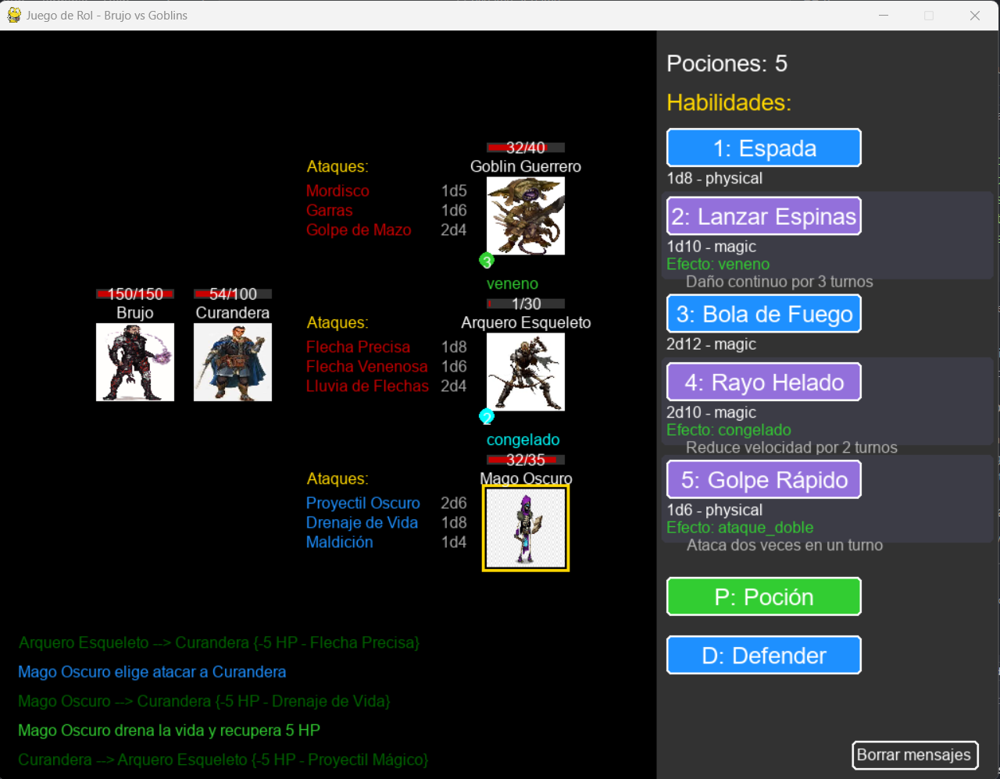

# Pygame AI RPG - Documentación



## Descripción
Tavern AI es un juego de rol táctico por turnos ambientado en una taberna medieval mágica. Controlas a un Brujo y una Curandera aliada que deben enfrentarse a diversos enemigos mientras avanzan hacia un enfrentamiento final con el poderoso Señor del Caos. El juego integra inteligencia artificial avanzada para controlar el comportamiento de los enemigos, creando una experiencia de combate dinámica y estratégica.

## Características principales
- Sistema de combate por turnos con profundidad táctica
- Múltiples habilidades y ataques con efectos visuales impactantes
- Efectos de estado (veneno, sangrado, congelación, debilitamiento, etc.)
- IA estratégica para enemigos con comportamiento visible y comprensible
- Jefe final adaptativo con múltiples habilidades devastadoras
- Integración con ChatGPT para decisiones estratégicas en tiempo real
- Interfaz visual con animaciones de ataque y efectos de partículas
- Sistema de mensajes de combate detallado

## Inteligencia Artificial y Estrategia
Tavern AI destaca por su sistema de IA visible y comprensible:

- **Priorización de objetivos**: Observa cómo los enemigos analizan el campo de batalla y priorizan atacar primero a tu Curandera para eliminar el soporte de curación.
- **Aplicación estratégica de efectos**: La IA aplica efectos de estado como veneno o sangrado para causar daño continuo, o debilitamiento para reducir tu efectividad.
- **Adaptación según la situación**: Los enemigos evalúan su propia salud, tus puntos débiles y la presencia de efectos activos para tomar decisiones.
- **Jefe final inteligente**: El Señor del Caos utiliza una IA mejorada que combina todos estos elementos para ofrecer un desafío único.

## Requisitos
- Python 3.7 o superior
- Pygame 2.0.0 o superior
- OpenAI Python (opcional, para integración con IA)
- Dotenv (para manejo de variables de entorno)

## Instalación

1. Clona el repositorio:
```bash
git clone https://github.com/DarkChris11/tavern-ai-game
cd pygame-ai-game
```

2. Crea y activa un entorno virtual:
```bash
python -m venv venv
# En Windows
venv\Scripts\activate
# En macOS/Linux
source venv/bin/activate
```

3. Instala las dependencias:
```bash
pip install -r requirements.txt
```

4. Configuración de la API de OpenAI (opcional pero recomendado):
   - Crea un archivo .env en la raíz del proyecto
   - Añade tu clave de API: `OPENAI_API_KEY=tu_clave_aqui`

## Cómo jugar

### Iniciar el juego
```bash
python main.py
```

### Controles
- **Números 1-5**: Usar ataques/habilidades
- **Tab**: Cambiar entre objetivos enemigos
- **P**: Usar poción
- **D**: Defender
- **C**: Borrar historial de mensajes
- **ESC**: Volver al menú principal

### Mecánicas de juego
- **Combate por turnos**: Tú atacas primero, luego los enemigos
- **Efectos de estado**: Algunos ataques aplican efectos que duran varios turnos:
  - *Veneno*: Daño continuo por turno
  - *Sangrado*: Daño basado en porcentaje de salud
  - *Congelación*: Reduce la velocidad y posibilidad de perder turno
  - *Debilitamiento*: Reduce el daño causado
  - *Drenaje*: El atacante recupera parte del daño como salud
- **Aliado con IA**: La Curandera utilizará su IA para decidir entre atacar o curarte según la situación
- **Pociones**: Usa pociones para recuperar salud en momentos críticos
- **Progresión de biomas**: Avanza por distintos entornos hasta llegar al Señor del Caos

## El Jefe Final
Al final de tu aventura te enfrentarás al Señor del Caos, un poderoso enemigo con:

- Estadísticas adaptadas a tu nivel de juego
- Cinco ataques devastadores con diversos efectos
- IA superior que utiliza estrategias combinadas
- Mayor resistencia y capacidad de daño

## Estructura del proyecto
```
tavern-ai-game/
├── assets/
│   └── images/       # Imágenes del juego
├── config/
│   ├── game_config.json    # Configuración del juego
│   └── openai_config.json  # Configuración de la API
├── src/
│   ├── abilities.py        # Sistema de ataques y efectos
│   ├── characters.py       # Clases de personajes
│   ├── enemies.py          # Generación de enemigos y jefe final
│   ├── engine.py           # Motor principal del juego
│   ├── menu.py             # Sistema de menús
│   ├── scenarios.py        # Escenarios y progresión
│   ├── tutorial.py         # Tutorial interactivo
│   ├── ui.py               # Interfaz de usuario
│   └── ai/                 # Módulos de IA
│       ├── chatgpt_client.py  # Cliente para OpenAI
│       └── decision_engine.py # Lógica de decisiones
├── main.py                 # Punto de entrada
└── requirements.txt        # Dependencias
```

## Integración con ChatGPT

El juego utiliza la API de OpenAI para potenciar el comportamiento estratégico de los enemigos. Observa cómo evalúan la situación y toman decisiones basadas en:

- Salud actual del jugador, curandera y otros enemigos
- Ataques disponibles y sus efectos potenciales
- Presencia y duración de efectos de estado activos
- Priorización inteligente de objetivos (curandero primero)
- Evaluación de amenazas y oportunidades tácticas

Para habilitar esta función, asegúrate de:
1. Tener una clave API válida de OpenAI
2. Configurar correctamente el archivo .env
3. Verificar la configuración en openai_config.json

## Personalización

### Añadir nuevos ataques
Edita characters.py para añadir nuevos ataques a personajes:

```python
"Nuevo Ataque": {
    "dice": 2,        # Número de dados
    "sides": 8,       # Caras por dado
    "type": "magic",  # Tipo (physical, magic, holy)
    "effect": "veneno" # Efecto opcional
},
```

### Crear nuevos enemigos
Modifica enemies.py para añadir nuevos tipos de enemigos con sus propios ataques y estadísticas.

### Modificar la dificultad del jefe final
Puedes ajustar la fórmula de cálculo de salud y daño del jefe final en la función `create_boss()` del archivo `enemies.py`.

## Créditos
- Desarrollado por DarkChris
- Creado con Pygame
- Integración con la API de ChatGPT de OpenAI
- Efectos visuales y sistema de partículas personalizados

## Licencia
Este proyecto está bajo la licencia MIT.

---

¡Reúne tu valor, afila tu estrategia y enfrenta al Señor del Caos en Tavern AI!

